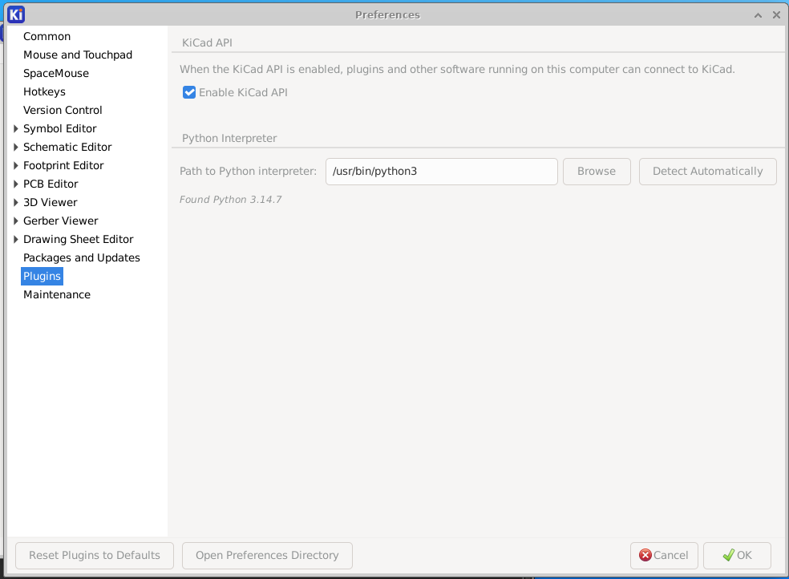
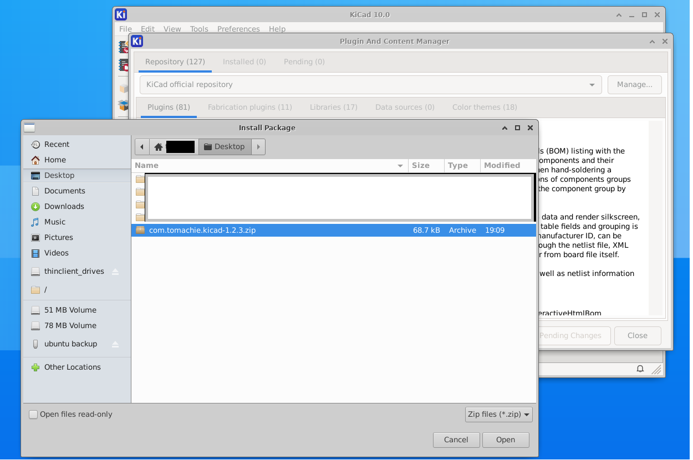
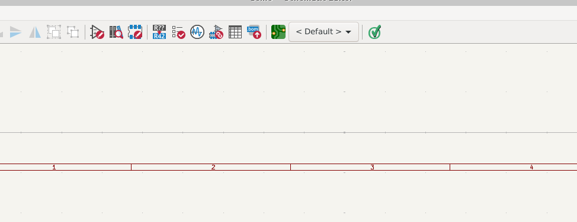
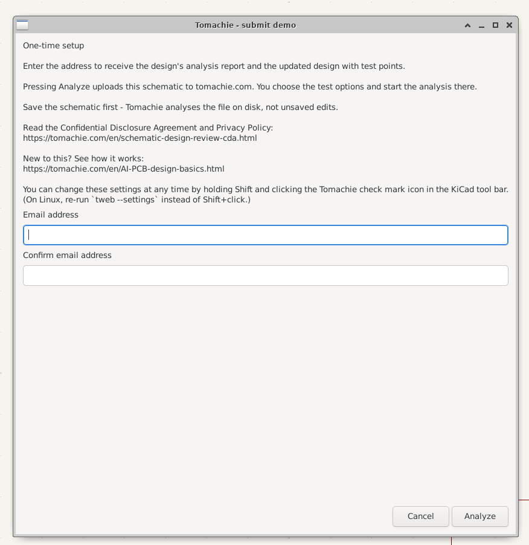
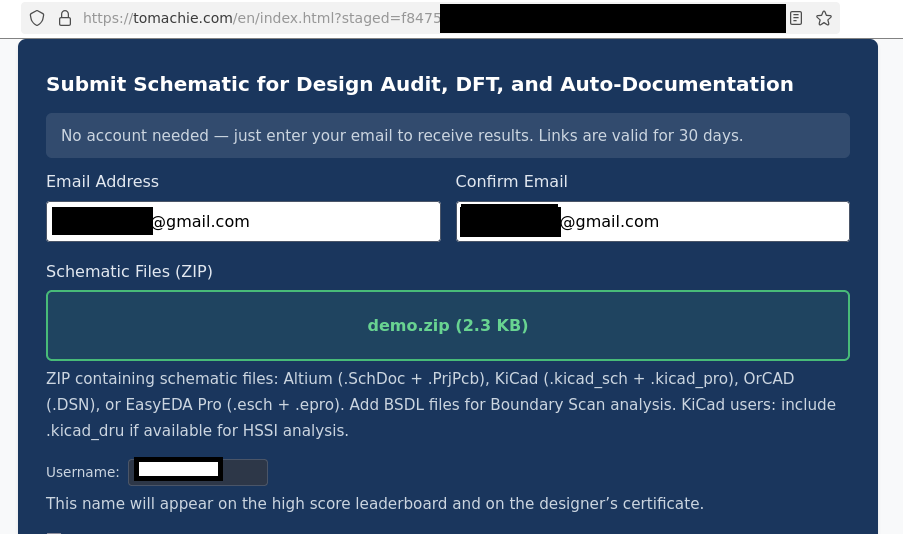

# Tomachie for KiCad

A button in KiCad's schematic editor that sends the currently opened design to
[Tomachie](https://tomachie.com) for design-for-test analysis: checks that go
deeper than ERC (part-number-to-value checks, life-cycle checks, pull-up/dn and more), 
test-point insertion, and an AI design review. The checks and
test-point insertion are free, and so is the AI review for one-page designs.
You choose the options in your browser, and the results are emailed to you.

**Requirements:** Windows, KiCad 10.0 or later. On Linux, build from source
(see below).

## Download and install — no build needed

**[⬇ Download the latest release](https://github.com/Tomachie/AI-PCB-Design-KiCad-Plugin/releases/latest)**
— the file `com.tomachie.kicad-<version>.zip` under *Assets*. The same package
is on <https://tomachie.com/en/kicad-plugin.html>.

1. **Do not unzip it.** KiCad installs the zip as it is.
2. KiCad → **Plugin and Content Manager** → *Install from File…* → choose the
   zip.
3. Restart KiCad.

**Or add our repository**, which brings updates automatically: Plugin and
Content Manager → *Manage…* → add `https://tomachie.com/kicad/repository.json`
→ install **Tomachie**.

Use the released package rather than building your own: it is the build the
Tomachie service is tested against, and KiCad updates it for you through the
repository.

The plugin uses the KiCad API. If Preferences → Plugins → *Enable KiCad API*
is off, KiCad offers to switch it on when the plugin is installed. While it is
off, no plugin button appears.

The Tomachie check mark is at the right-hand end of the schematic editor's top
toolbar. To move it, for example next to the Electrical Rules Checker:
Preferences → Schematic Editor → Toolbars → *Top main* → drag
*IPC/Scripting plugins*.

## What it sends, and when

1. It asks KiCad over the KiCad API which schematic is open.
2. It finds the project file in KiCad's list of open projects and follows the
   sheet hierarchy from the root sheet.
3. It zips **only** the schematic sheets the design references (`.kicad_sch`),
   the project file (`.kicad_pro`) and the design rules (`.kicad_dru`). No PCB
   layout, Gerbers, 3D models, backups, `.history` or other files in the
   folder.
4. On the first run only, a dialog asks for the email address the results go
   to, and links to the
   [Confidential Disclosure Agreement and Privacy Policy](https://tomachie.com/en/schematic-design-review-cda.html).
5. It uploads the zip over HTTPS to `https://tomachie.com/stage` and opens the
   page the server returns in your browser.

**Nothing is analysed until you press Analyze on that page.** A staged upload
that is not submitted is deleted after two hours. The server is the only place
the analysis runs. This client contains no analysis.

Save the schematic before clicking: KiCad gives a plugin no way to save for you
or to detect unsaved edits, so the plugin sends what is on disk.

The plugin stores one file of its own, `%APPDATA%\Tomachie\tweb_user.json`,
holding the email address. Hold **Shift** while clicking the button to change
it. It sends no telemetry.

## Building from source (optional)

Only needed to inspect or change the code, and on Linux to install at all. To
use the plugin on Windows, install the
[released package](https://github.com/Tomachie/AI-PCB-Design-KiCad-Plugin/releases/latest).

Visual Studio 2022 (MSVC, C++17), no other dependencies. KiCad's own `nng.dll`
(API transport) and `zlib1.dll` (zip compression) are loaded at run time.

```
build.bat                           builds out\tweb.exe
python make_package.py 1.2.0        builds the KiCad package into build\
```

`make_package.py` checks every package file against the schema KiCad
ships (`share\kicad\schemas\pcm.v2.schema.json`) and builds nothing if one
fails. It needs `python -m pip install jsonschema`.

Offline tests, no KiCad needed:

```
tweb.exe --collect <project_dir> <root_sheet.kicad_sch>   package only
tweb.exe --stage   <archive.zip>                          upload only
tweb.exe --settings                                       open the dialog
```

Each run is logged to `tweb_log.txt` beside `tweb.exe`.

### Linux

`tweb_linux.cpp` is `tweb.cpp` ported to Linux. The protocol, the sheet walk,
the zip layout and the upload are unchanged; only the OS layer differs:

| Windows | Linux |
|---|---|
| WinHTTP | the `curl` command line |
| `LoadLibrary("nng.dll")` | `dlopen("libnng.so.1")` — KiCad's own library |
| Win32 dialogs | `zenity`; GTK through `python3` where there is no `zenity` (KiCad's Flatpak); the terminal when neither |
| `ShellExecute` | `xdg-open` |
| `%APPDATA%` | `~/.config` (`XDG_CONFIG_HOME` outside a Flatpak) |

Build and install need only `g++`, the zlib headers and, to check the package
against KiCad's schema, Python's `jsonschema`:

```
Fedora:         sudo dnf install gcc-c++ zlib-devel python3-jsonschema
Debian/Ubuntu:  sudo apt install build-essential zlib1g-dev python3-jsonschema

sh build.sh                            builds out/tweb
python3 make_package_linux.py 1.2.3    builds the KiCad package into build/
```

The package script finds KiCad's schema in a distribution install or in a
KiCad Flatpak (system-wide or per-user). Tested on Fedora (g++ 16.2, KiCad
10.0.6) and on Ubuntu 20.04 (g++ 9.4, KiCad 10.0.6 from Flathub).

Then, in KiCad:

1. Preferences → Plugins → tick **Enable KiCad API**, and restart KiCad.

   

2. Plugin and Content Manager → **Install from File…** →
   `build/com.tomachie.kicad-1.2.3.zip`, and restart KiCad.

   

3. The Tomachie check mark is at the right-hand end of the schematic editor's
   toolbar.

   

4. The first click asks once for the email address and shows where the design
   goes.

   

5. The browser opens tomachie.com with the design staged. Nothing is analysed
   until Analyze is pressed there.

   

At run time the plug-in uses `curl`, `xdg-open`, KiCad's `libnng.so.1`, and
`zenity` or Python's GTK for the dialogs. A normal desktop has them, and so
does KiCad's Flatpak (which has Python's GTK instead of `zenity`).

One difference to the Windows build: KiCad does not pass the Shift key to a
plug-in process, so the button cannot open the settings dialog on a click.
Run `tweb --settings` in a terminal instead; the first-run dialog shows the
full path of the installed `tweb`. The stored settings file is
`~/.config/Tomachie/tweb_user.json`, the Linux counterpart of
`%APPDATA%\Tomachie\tweb_user.json`, also when KiCad runs as a Flatpak.

## Files

| File | Purpose |
|---|---|
| `tweb.cpp` | The client: KiCad API, project resolution, sheet walk, zip writer, upload, first-run dialog |
| `tweb_linux.cpp` | The same client for Linux (see above) |
| `string_table.h/.cpp` | Dialog strings (`i18n/tweb_<lang>.txt`) |
| `string_table_linux.cpp` | The same strings, with the language read from the locale environment |
| `plugin.json` | KiCad plugin manifest |
| `tweb.json` | Paths on tomachie.com the client uses |
| `pcm/metadata.json` | Plugin and Content Manager package description |
| `tweb.rc`, `tweb.ico`, `icon-*.png` | Icons and version resources |
| `build.bat`, `make_package.py` | Build the exe; build and check the KiCad package |
| `build.sh`, `make_package_linux.py` | The same for Linux |
| `extract_proto.py` | Extracts KiCad's protobuf descriptors from `kiapi.dll`, to re-check field numbers when KiCad changes version |

## Licence

MIT. See [LICENSE](LICENSE). Tomachie's analysis service is operated by
Tomachie LLC and is not part of this repository.
